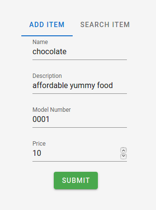
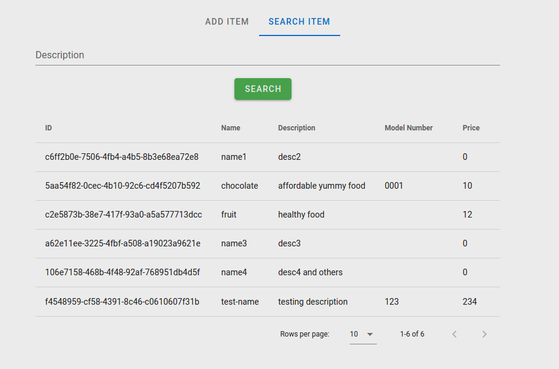
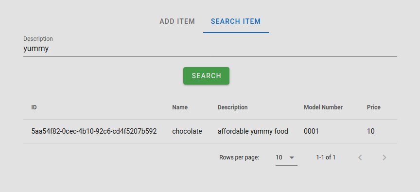

# Intro
This repo is one of the microservices. Other related repo is <b>[go-project-demo](https://github.com/alanyeung95/go-project-demo)</b>  and <b>[elasticsearch-monstache-demo](https://github.com/alanyeung95/elasticsearch-monstache-demo)</b>

Please setup the project under this order:

1. go-project-demo
2. elasticsearch-monstache-demo
3. vue-project-demo

# Use-case analysis
## Add product items


## List items in search view


## Search items by product description


This simple has demostrate how these three microservices (<b>vue-project-demo</b>, <b>[go-project-demo](https://github.com/alanyeung95/go-project-demo)</b>  and <b>[elasticsearch-monstache-demo](https://github.com/alanyeung95/elasticsearch-monstache-demo)</b>) work together

Here is the detail flow:
1. Input data from Vue.js to mongoDB and send API request
2. Go API backend receive the API request and save model data to mongoDB
3. Monstache synchronize the new/updated data from mongoDB to Elasticsearch
    1. Elasticsearch may map the data by using custom mapping or dynamic mapping
4. Vue list search result by querying Elasticsearch

# Development
## Project create

```
vue create .
```

## Project setup

```
npm install
```

### Compiles and hot-reloads for development

```
npm run serve
```

### Compiles and minifies for production

```
npm run build
```

### Lints and fixes files

```
npm run lint
```

### Customize configuration

See [Configuration Reference](https://cli.vuejs.org/config/).

### Install Vueifty

```
vue add vuetify
```

# Todo list:
- [x] Search feature to demostrate the ES text query
- [ ] User Login
- [ ] Typescript checking in API response

# Notes

### Q1: What is ESLint and why we need to use it?

Linting tools like ESLint allow developers to discover problems with their JavaScript code without executing it. The primary reason ESLint was created was to allow developers to create their own linting rules. It can also be usesd with githook so that it can check your code before commit automatically.

1.  Check syntax before running
2.  Prettier plugin can format your code
3.  Will suggest best practise code like using `let` instead of `var`, prefer `===` rather than `==`
4.  Warning unused import

### Q2: Why we need to use typescript rather than pure javascript?

Typescript can let use to define an interface (e.g. request param) and it will do a type validation during compilation. For example, it can help us to debug after we update our schema

### Q3: What is Vuetify?

Vuetif is the #1 component library for Vue.js and has been in active development since 2016


### Note to use Vuetify

```
In order for your application to work properly, you must wrap it in a v-app component. This component is used for dynamically managing your content area and is the mounting point for many components.
```
